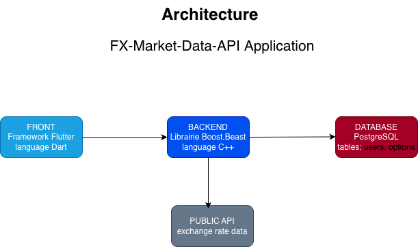
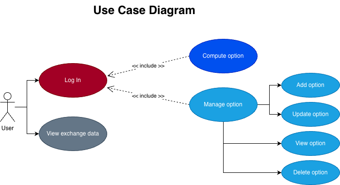
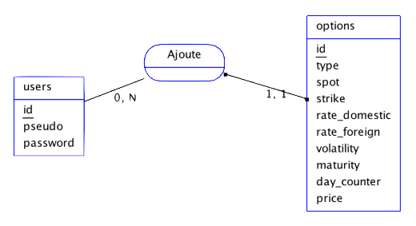
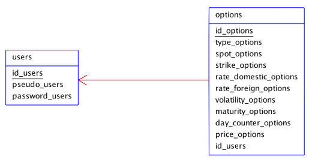

[back](./)

<h3>Features</h3>

- Give exchange rates data with EUR as the base currency from external API
- Compute the price of options from backend c++ API
- Persist users and options data on postgreSQL database

---

<h3>Architecture Diagram</h3>

---

<h3>Use Case Diagram</h3>

---

<h3>Entity-Relationship Diagram</h3>

---

<h3>Logical Data Model Diagram</h3>

<!-- <video controls width="500">
  <source src="./assets/explications.mp4" type="video/mp4">
</video> -->

<!-- <iframe width="560" height="315"
src="https://www.youtube.com/embed/CPrePbvbbic"
allow="accelerometer; autoplay; clipboard-write; encrypted-media; gyroscope; picture-in-picture; web-share" allowfullscreen>
</iframe> -->
