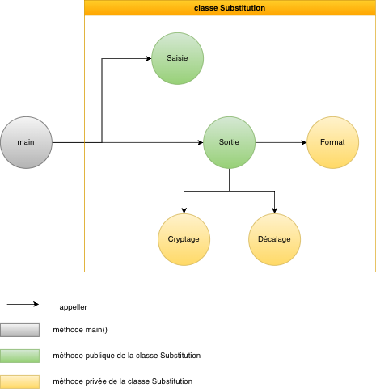
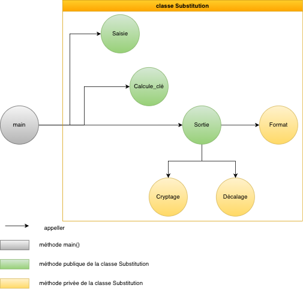
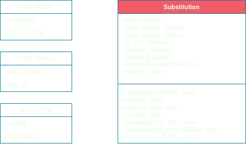

[back](./)

<h3>Features</h3>

- Encrypt uppercase text using a key
- Recover the substitution key from plaintext–ciphertext pairs

---

<h3>Architecture Diagram of the C++ program</h3>

Encrypt uppercase text using a key

Recover the substitution key from plaintext–ciphertext pairs

---

<h3>Class Diagram</h3>

---

<h3>Result Output Example</h3>

---

<h3>Explain project (in French) with tests</h3>

<iframe width="560" height="315"
src="https://www.youtube.com/embed/d25MXMe9U8s"
allow="accelerometer; autoplay; clipboard-write; encrypted-media; gyroscope; picture-in-picture; web-share" allowfullscreen>
</iframe>
